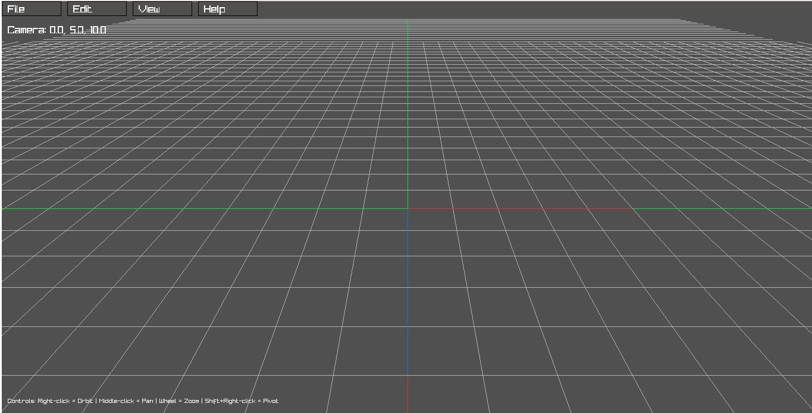

# Viewer UI

A 3D visualization platform with intuitive camera controls.

## Features

- **Interactive 3D Viewer**: Navigate complex 3D scenes with intuitive camera controls
- **Dark-themed UI**: Reduces eye strain during extended use
- **Extended Grid System**: Provides precise spatial reference
- **Clean Navigation**: Top menu bar with organized command structure
- **Resizable Interface**: Adapts to different screen configurations
- **Cross-platform**: Runs on multiple operating systems

## Controls

- **Right-click + Drag**: Orbit camera
- **Middle-click + Drag**: Pan camera
- **Mouse Wheel**: Zoom in/out
- **Shift + Right-click**: Set new pivot point

## Development

Built with:
- C++14
- [raylib](https://www.raylib.com/) for graphics and input

## License

This project is licensed under the MIT License - see the [LICENSE](LICENSE) file for details.
